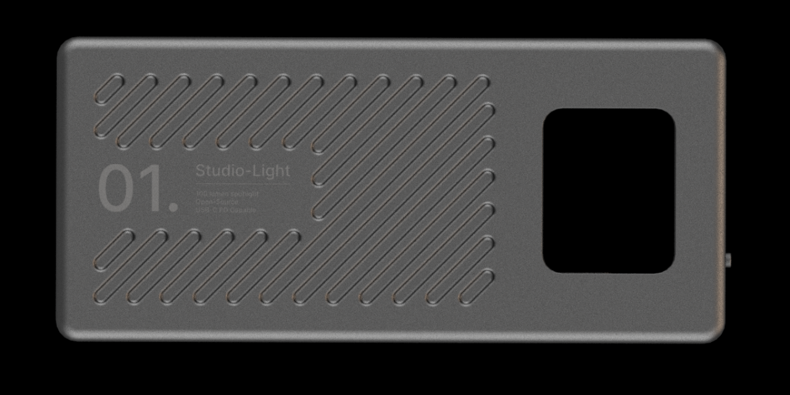

# studio-light-01

## Overview
Welcome to studio-light-01, an open-source manufacturing-ready studio light project. This project is designed around the ESP32-S3 microcontroller, capacitive touch OLED display, and a custom Flutter mobile application. Whether you're a hobbyist, DIY enthusiast, or a professional in need of a versatile studio light solution, studio-light-01 has you covered.

## Features
- **ESP32-S3 Integration:** Leverage the power of ESP32-S3 for seamless BLE/Wi-Fi connectivity and robust dual-core performance.
- **Capacitive Touch OLED Display:** Intuitive UX touch controls for easy operation and adjustment of light settings.
- **Custom Flutter Mobile Application:** Control your studio light remotely with a cross-platform mobile application built using Flutter framework.
- **Open Source:** Modify, customize, and contribute to the project freely under the GNU General Public License.

## Folder Structure
📁 **hardware**: Contains schematics, PCB designs, and related hardware documentation.

📁 **images**: Store visual assets such as project photos, diagrams, and banners.

📁 **mechanical**: Explore mechanical designs, CAD files, and assembly instructions.

📁 **software**: Access firmware code, mobile app source files, and software documentation.

📄 **LICENSE**: View the project's licensing information.

📄 **README.md**: You're here! This README provides an overview of the project and its structure.

## Getting Started
1. **Hardware Setup:** Refer to the hardware folder for schematics and assembly instructions.
2. **Software Installation:** Follow the software folder for firmware and mobile app setup.
3. **Customization:** Feel free to customize the design to suit your specific requirements.

## Contributing
Contributions are welcome! Whether you're a developer, designer, or maker, your input can help enhance # studio-light-01. Check out the contribution guidelines in the LICENSE file for more details.

## License
This project is licensed under the GNU General Public License - see the LICENSE file for details.

